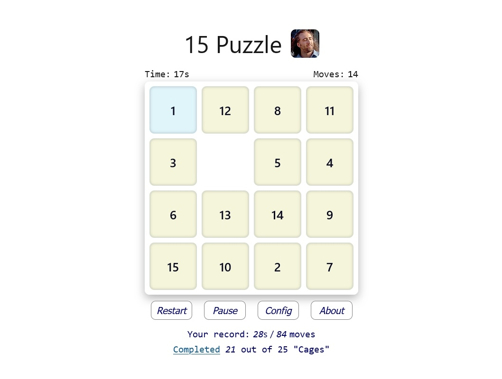
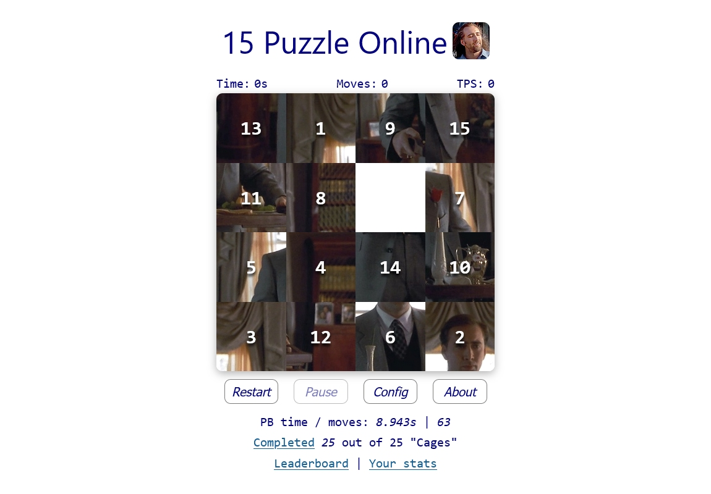

# 15 Puzzle

"15 Puzzle" online game (_featuring Nic Cage_). It was made using Vue 3 (Typescript + Pinia), which gives the most modern developing way with strict type checking, producing a fast-loading web application.

### Play game here:

https://15puzzle.uk/

## Game instructions

The 15 Puzzle is a classic sliding game. The rule is simple: move blocks until they are in regular order.
You can play online and beat records of time and moves. Also, dedicated fans can discover additional modes of the game.

## Features

1. Traditional game. Beat your records of time and moves.
2. Cage mode. You can unlock it if you solve a traditional puzzle in less than 60 seconds.
3. Solve the puzzle in Cage mode, and you will open a new Cage picture. There are many such images, and opening them all is a challenge. You can obtain your unlocked items in Cage Image Gallery (press the "Complete" link).
4. You can config the game: turn off Cage mode to perfect your records in the traditional game; play in hardcore Cage mode without numbers on blocks; disable Win message if it doesn't suit your game experience.

## Additional info

Every next game begins with the "Restart" button: after solving a puzzle or for reset the current game state.

## License

[MIT](https://opensource.org/licenses/MIT)

Copyright (c) 2023, SKE
