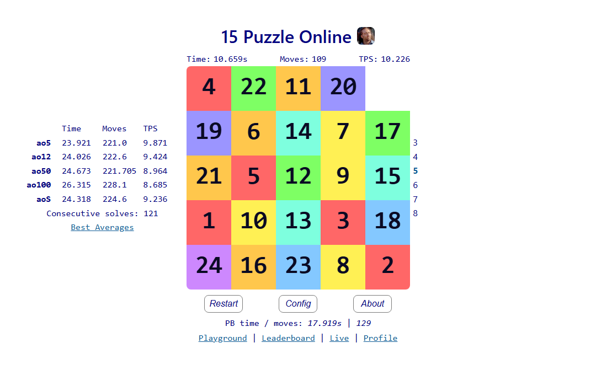
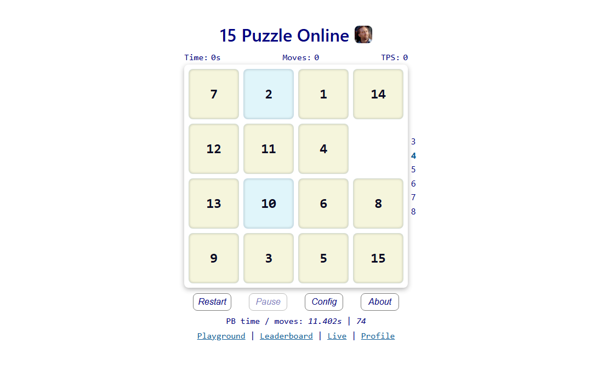
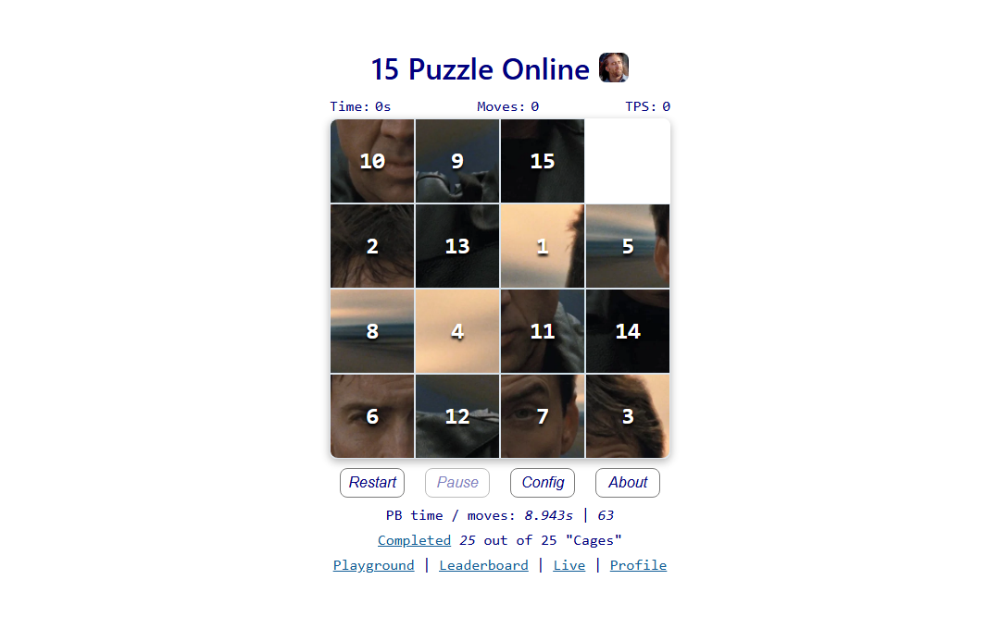

# 15 Puzzle

"15 Puzzle" online game (_featuring Nic Cage_). It is built with Vue 3 (TypeScript + Pinia), a modern approach with strict type checking that produces a fast-loading web application.

### Play the game here:

https://15puzzle.uk

The game opens in Pro mode (speed sliding) by default. Casual and Cage modes can be switched on in the config.

## Game introduction

The 15 Puzzle is a classic sliding game. The rule is simple: move the blocks until they are in order.
You can play and beat online records of time and moves, and dedicated fans can discover more game modes.

## Features

1. Personal and online records in every mode. Every solved puzzle is measured against your best time and your fewest moves, kept separately for each puzzle size, for single games and for Marathon runs, while FMC Blitz keeps its own moves record. Your records are saved in the browser, so they count from your very first game, with no account needed. Register, and every game is also stored in the online records database: your records follow you to any device (browser) you log in on and are ranked against the best results of other players on the leaderboard. Registered players in Pro mode also get rolling averages (ao5, ao12, ao50, ao100), with average records of their own, on all puzzle sizes in both single and Marathon play.
2. Pro mode (speed sliding), the default mode. The puzzle is shown in a fringe color scheme, and you move the tiles by hovering the mouse. This mode is for professional and highly skilled players: world champions in this discipline and those who want to join them. Can you solve the "15 puzzle" in 1-2 seconds? It's possible, and several people in the world do it!
3. Marathon mode: solve five puzzles in a row without a pause.
4. Casual mode (animated tiles) for relaxed and beginner players. Tiles slide smoothly into place, and you can pause a game. Switch it on in the config.
5. Cage mode. Here the puzzle is a sliced image that needs to be put back together. Each puzzle you solve in Cage mode unlocks a new Cage picture. There are many of them, and unlocking them all is a challenge. You can see all unlocked pictures in the Cage Image Gallery (press the "Completed" link).
6. You can choose different puzzle sizes: 3x3, 4x4, 5x5, 6x6, 7x7 and 8x8.
7. Playground mode. Practise your skills here: choose a scramble and try to solve it in the best time or find an optimal solution. You can add your own scramble or get a random one, and share your game with its results.
8. After each game, you get a link to a page with the game stats and a replay.
9. You can configure the game: turn off Cage mode to improve your records in the traditional game, play hardcore Cage mode without numbers on the blocks, or disable the Win message if it doesn't suit you. You can also save the current game session, change the control mode, switch on dark mode, and more.
10. "15 puzzle online" works perfectly in every modern desktop browser, on Android and iOS, on small phones and on tablets. Play wherever and however you like.
11. In your profile, you can see all your games with their stats, sort them by date, time or moves, and get the solution or scramble of any game.
12. For the 3x3 puzzle, you can see how far your moves are from the optimal solution after each game, and also in other places: your games in the profile, the replay page, etc.
13. Exclusive G1000 mode for 3x3 savants (https://15puzzle.uk/?g1000). You must finish 1000 3x3 puzzles without skipping any.
14. Loading games data from your last session (profile/your games).
15. FMC (fewest moves challenge) Blitz mode: solve puzzles within 180 seconds with the lowest total of moves.

## Additional info

Each new game starts with the "Restart" button (Space key): press it after solving a puzzle or to reset the current game.
Press "PageUp"/"PageDown" to increase/decrease the puzzle size. In playground mode, "Ctrl + Space" renews the puzzle, and Space restarts the same scramble. Hold "Ctrl" to move the mouse to the middle blank tile and start solving from there. Rolling averages (ao5, ao12, etc.) are important indicators for pro players. If you are one of them, you know what they mean. In short, it is the average of your times/moves over 5, 12, 50 or 100 finished solves, leaving out the best and worst 5% of results. To get average records (see the "Best" link), solve puzzles consecutively and reset a scramble only after completing it.

## Acknowledgments

Thanks a lot to the Speedsliding community for giving advice, testing, filling the leaderboard with the best-ever results, and having fun :)

## Contact

If you have questions or suggestions about the game, you can send a message to 15puzzle.uk@gmail.com.

## License

[MIT](https://opensource.org/licenses/MIT)

Copyright (c) 2023–2026, SKE
