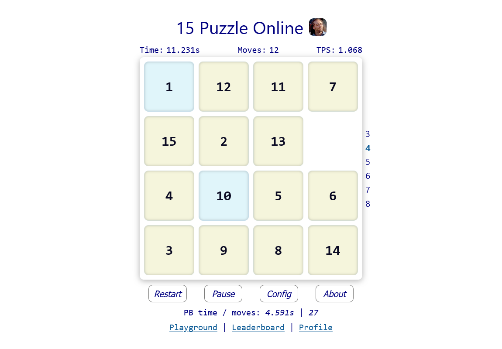
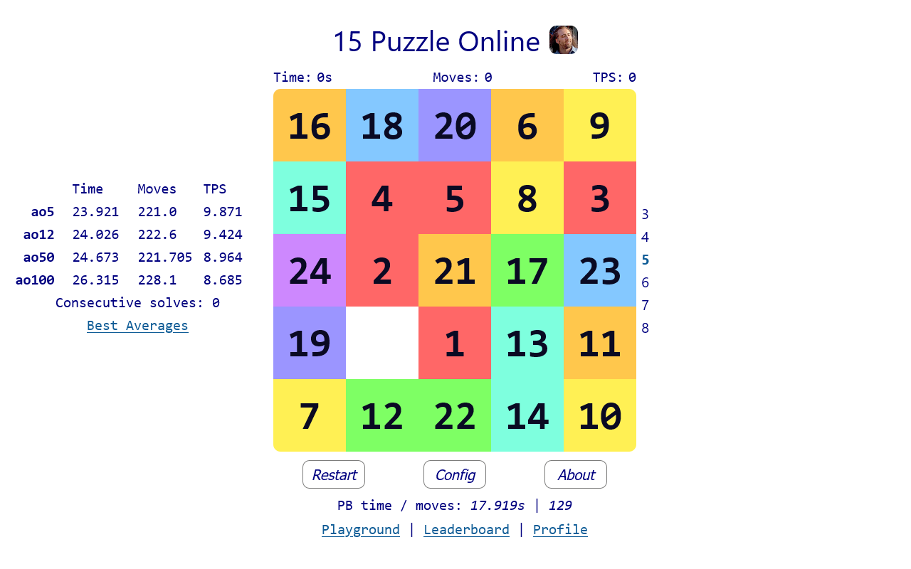

# 15 Puzzle

"15 Puzzle" online game (_featuring Nic Cage_). It was made using Vue 3 (Typescript + Pinia), which gives the most modern developing way with strict type checking, producing a fast-loading web application.

### Play the game here:

https://15puzzle.uk \
https://15puzzle.uk?pro (speed sliding)

## Game introduction

The 15 Puzzle is a classic sliding game. The rule is simple: move blocks until they are in regular order.
You can play and beat online records of time and moves. Also, dedicated fans can discover additional modes of the game.

## Features

1. Traditional mode for casual and beginner players. Beat your personal records of time and moves.
2. Cage mode. The puzzle here is a sliced image that needs to be joined. Solve the puzzle in Cage mode, and you will open a new Cage picture. There are many such images, and opening them all is a challenge. You can obtain all unlocked items in the Cage Image Gallery (press the "Complete" link).
3. Pro mode (speed sliding). The puzzle is represented in a fringe color scheme, and you control movement with mouse hover. This mode is intended for professional and highly skilled experienced players; for world champions in this discipline, and for those who want to be among them. Can you solve "15 puzzle" in 1-2 seconds? It's possible, and several people in the world do this!
4. You can select different puzzle sizes: 3x3, 4x4, 5x5, 6x6, 7x7 and 8x8
5. Marathon mode: you need to beat five puzzles in a row without any pause.
6. Online records database. Register your account then game time/moves will be stored and compared to other best results. There are single and averages records on all puzzle sizes and two modes. You can log in to different devices (browsers) with your account.
7. Playground mode. You can master your skills here. Choose scramble and try to solve it with the best time or find an optimal solution. You can add your own scramble or choose it randomly. Also, it is possible to share your game with received results.
8. After each game, you will have a link to the page with game stats and a replay feature.
9. You can configure the game: turn off Cage mode to perfect your records in the traditional game; play in hardcore Cage mode without numbers on blocks; disable Win message if it doesn't suit your game experience. Change control mode or set dark screen mode and others.
10. "15 puzzle online" works perfectly on every modern desktop browser, android and iOS platforms, small-size mobiles, and tablets. You are free to choose where and how you prefer to play.
11. In your profile, you can see all played games with stats. Sort by date, time, and moves, or get a solution/scramble from the chosen game.

## Additional info

Every next game begins with the "Restart" button (space key): press it after solving a puzzle or if you want to reset the current game state.
Press the "PageUp"/"PageDown" keys to increase/decrease puzzle size. "Ctrl + Space" will renew the puzzle in playground mode, and space will restart the same scramble. Holding the "Ctrl" key will allow you to move the mouse to the middle blank tile and start solving from there. Rolling averages (ao5, ao12, etc.) are important indicators for pro players. If you are among them, you understand their meaning. Essentially, it's a sum of your times/moves divided by the number of the finished solves, minus the best and worst 5% game results among 5, 12, 50, or 100. Pro marking means that you have averages of consecutive games (a session of 5, 12, etc).

## Acknowledgments

Thanks a lot to the [Speedsliding community](https://discord.com/channels/800441014611214337) for giving advice, testing, filling the leaderboard with the best-ever results, and having fun :)

## Contact

If you have questions or suggestions about the game, you can send messages to 15puzzle.uk@gmail.com.

## License

[MIT](https://opensource.org/licenses/MIT)

Copyright (c) 2023, SKE
